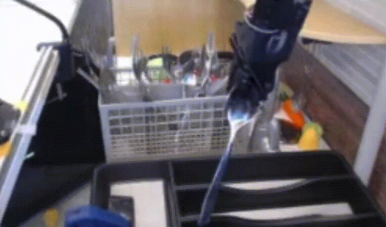
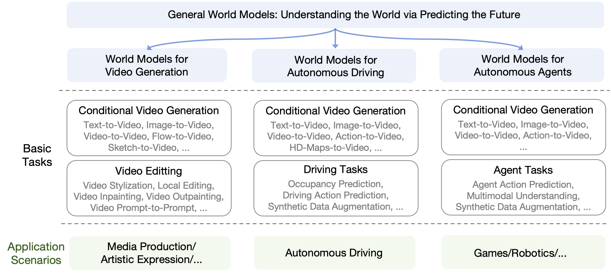
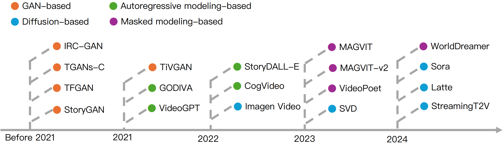
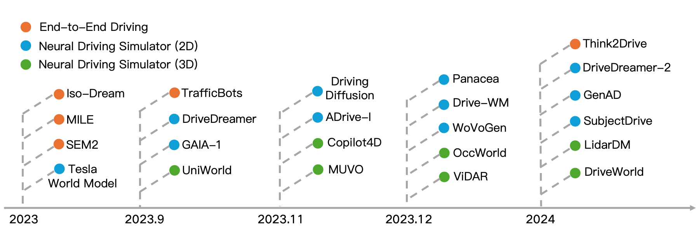
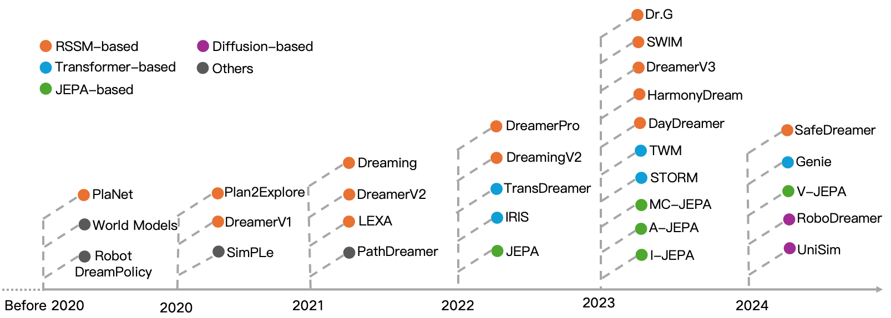

# [Is Sora a World Simulator? A Comprehensive Survey on General World Models and Beyond](https://arxiv.org/abs/TODO) [](https://github.com/sindresorhus/awesome)  [](https://arxiv.org/abs/TODO) 


<div style="text-align:center; font-size: 18px;">
    <p>
    <a href="https://scholar.google.com/citations?user=NmwjI0AAAAAJ&hl=en">Zheng Zhu*</a>, 
    <a href="https://scholar.google.com/citations?user=NmwjI0AAAAAJ&hl=en">Xiaofeng Wang*</a>,
    <a href="https://scholar.google.co.jp/citations?user=aocj89kAAAAJ&hl=es">Wangbo Zhao*</a>,
    <a href="https://scholar.google.com/citations?user=pE9gTMQAAAAJ&hl=zh-CN">Chen Min*</a>,
    <a href="">Nianchen Deng*</a>,
    <a href="https://scholar.google.com.hk/citations?hl=zh-CN&user=w9fTWKQAAAAJ">Min Dou*</a>,
    <a href="https://scholar.google.com/citations?user=35UcX9sAAAAJ&hl=en">Yuqi Wang*</a>,
    <a href="https://scholar.google.com.hk/citations?hl=zh-CN&user=K0PpvLkAAAAJ">Botian Shi<sup>#</sup></a>,
    <a href="https://scholar.google.com/citations?user=i2II0XIAAAAJ&hl=en">Kai Wang<sup>#</sup</a>,
    <a href="https://scholar.google.com/citations?user=aTA2wL4AAAAJ&hl=en">Chi Zhang<sup>#</sup</a>,
    <a href="">Yang You<sup>#</sup</a>,
    <a href="https://scholar.google.com/citations?user=qxWfV6cAAAAJ&hl=en">Zhaoxiang Zhang<sup>#</sup</a>,
    <a href="">Dawei Zhao<sup>#</sup</a>,
    <a href="https://scholar.google.com/citations?user=hvxSnzoAAAAJ&hl=lt">Liang Xiao<sup>#</sup</a>,
    <a href="https://scholar.google.com.sg/citations?hl=en&user=zdhRJCkAAAAJ&view_op=list_works&gmla=AJsN-F4PURIx5GMQHVpprJJBjTsNC62YCHjxGsKOwVhrkZ1aJsLgBiuKPBbAgbdcE5_KNw3OnLQgOVSjlqmS6gc-6ti0M2K5o-klHgoOywFCbdaaGnpis130zvgoZFJkVfmoNKpo8Krp">Jian Zhao<sup>#</sup</a>,
    <a href="https://scholar.google.com/citations?user=TN8uDQoAAAAJ&hl=en">Jiwen Lu<sup>#</sup</a>,
    <a href="">Guan Huang<sup>#</sup</a>
</div>

<div style="text-align:center; font-size: 18px;">
    <p>
    (* denotes equal contributions,  <sup>#</sup> denotes corresponding authors)
</div>


<p align="center">
  
  
</p>


<p align="center">


</p>


<p align="center">

</p>

<p align="center">

    
    
</p>


<p align="center">
(Source: <a href="https://universal-simulator.github.io/unisim/">UniSim</a>, <a href="https://universal-policy.github.io/unipi/">UniPi</a>, <a href="https://robovideo.github.io/">RoboDreamer</a>, <a href="https://openai.com/sora">Sora</a>, <a href="https://drivedreamer.github.io/">DriveDreamer</a>, <a href="https://drivedreamer2.github.io/">DriveDreamer-2</a>, <a href="https://drive-wm.github.io/">Drive-WM</a>)
</p>


<!-- - [News] <span style="color:red;"> **We are planning to update the survey soon to encompass the latest work. If you have any suggestions, please feel free to contact us.**</span>
- [News] The Chinese translation is available on [Zhihu](https://zhuanlan.zhihu.com/p/661860981). Special thanks to [Dai-Wenxun](https://github.com/Dai-Wenxun) for this.
 -->


This is the official repository for the technical report: 

**Is Sora a World Simulator? A Comprehensive Survey on General World Models and Beyond**.


## 📌 Introduction

In our report, we present a holistic examination of recent advancements in world model research, encompassing profound philosophical perspectives and detailed discussions. Our analysis delves deeply into the literature surrounding world models for **video generation**, **autonomous driving**, and **autonomous agents**, uncovering their applications in media production, artistic expression, end-to-end driving, games, and robots. We assess the existing challenges and limitations of world models and delve into prospective avenues for future research, with the intention of steering and igniting further progress in world models.



## Papers and Toolboxes for Video Generation World Models 


| Methods | Task | Github|
|:-----:|:-----:|:-----:|
| [Open-Sora-Plan](https://github.com/PKU-YuanGroup/Open-Sora-Plan/blob/main/docs/Report-v1.0.0.md)  | T2V Generation | [](https://github.com/PKU-YuanGroup/Open-Sora-Plan)|
| [Open-Sora](https://github.com/hpcaitech/Open-Sora/blob/main/docs/zh_CN/README.md)  | T2V Generation | [](https://github.com/hpcaitech/Open-Sora)|
| [Sora](https://openai.com/sora)  | T2V Generation & Editing | -|
| [IRC-GAN](https://www.ijcai.org/Proceedings/2019/0307.pdf) | T2V Generation | -|
| [TGANs-C](https://arxiv.org/pdf/1804.08264) | T2V Generation | -|
| [TFGANs](https://www.ijcai.org/Proceedings/2019/0276.pdf) | T2V Generation | -|
| [StoryGAN](https://openaccess.thecvf.com/content_CVPR_2019/papers/Li_StoryGAN_A_Sequential_Conditional_GAN_for_Story_Visualization_CVPR_2019_paper.pdf) | T2V Generation | [](https://github.com/yitong91/StoryGAN)|
| [TiVGAN](https://ieeexplore.ieee.org/stamp/stamp.jsp?arnumber=9171240) | T2V Generation | -|
| [GODIVA](https://arxiv.org/pdf/2104.14806) | T2V Generation | [](https://github.com/breadbread1984/GODIVA)|

## Papers and Toolboxes for Autonomous Driving World Models 


| Methods | Task | Github|
|:-----:|:-----:|:-----:|
| [Iso-Dream](https://proceedings.neurips.cc/paper_files/paper/2022/hash/9316769afaaeeaad42a9e3633b14e801-Abstract-Conference.html)  | End-to-end Driving|-|
| [MILE](https://proceedings.neurips.cc/paper_files/paper/2022/hash/827cb489449ea216e4a257c47e407d18-Abstract-Conference.html)  | End-to-end Driving|[Code](https://github.com/wayveai/mile)|
| [SEM2](https://arxiv.org/abs/2210.04017)  | End-to-end Driving|-|
| [TrafficBots](https://ieeexplore.ieee.org/abstract/document/10161243)  | End-to-end Driving|-|
| [Think2Drive](https://arxiv.org/abs/2402.16720)  | End-to-end Driving|-|
| [GAIA-1](https://arxiv.org/abs/2309.17080)  | Neural Driving Simulator (2D) |-|
| [Tesla](https://www.youtube.com/watch?v=6x-Xb_uT7ts) | Neural Driving Simulator|-|
| [DriveDreamer](https://drivedreamer.github.io/)  | Neural Driving Simulator (2D) | [Code](https://github.com/JeffWang987/DriveDreamer)|
| [ADriver-I](https://arxiv.org/abs/2309.17080)  | Neural Driving Simulator (2D) | -|
| [DrivingDiffusion](https://arxiv.org/abs/2310.07771)  | Neural Driving Simulator (2D) |-|
| [Panacea](https://panacea-ad.github.io/)  | Neural Driving Simulator (2D) | [Code](https://github.com/wenyuqing/panacea)|
| [Drive-WM](https://drive-wm.github.io/)  | Neural Driving Simulator (2D) & End-to-end Driving| [Code](https://github.com/BraveGroup/Drive-WM)|
| [WoVoGen](https://arxiv.org/abs/2312.02934)  | Neural Driving Simulator (2D) | -|
| [DriveDreamer-2](https://drivedreamer2.github.io/)  | Neural Driving Simulator (2D) | [Code](https://github.com/f1yfisher/DriveDreamer2)|
| [GenAD](https://arxiv.org/abs/2403.09630)  | Neural Driving Simulator (2D) | [Code](https://github.com/OpenDriveLab/DriveAGI?tab=readme-ov-file)|
| [SubjectDrive](https://subjectdrive.github.io/)  | Neural Driving Simulator (2D) | -|
| [Copilot4D](https://arxiv.org/abs/2311.01017)  | Neural Driving Simulator (3D) | -|
| [OccWorld](https://arxiv.org/abs/2311.16038)  | Neural Driving Simulator (2D) | [Code](https://github.com/wzzheng/OccWorld)|
| [MUVO](https://arxiv.org/abs/2311.11762)  | Neural Driving Simulator (3D) | -|
| [LidarDM](https://www.zyrianov.org/lidardm/)  | Neural Driving Simulator (3D) | -|
| [UniWorld](https://arxiv.org/abs/2308.07234)  | Neural Driving Simulator (3D) & 4D Pre-training| -|
| [ViDAR](https://arxiv.org/abs/2312.17655)  | Neural Driving Simulator (3D) & 4D Pre-training| [Code](https://github.com/OpenDriveLab/ViDAR)|
| [DriveWorld](XXX)  | Neural Driving Simulator (3D) & 4D Pre-training|-|


## Papers and Toolboxes for Autonomous Agents World Models 


| Methods | Task | Github|
|:-----:|:-----:|:-----:|
| [Sora](https://openai.com/sora)  | T2V Generation & Editing | -|


## Contact
If you find our survey is useful in your research or applications, please consider giving us a star 🌟 and citing it by the following BibTeX entry.

```
@article{generalworldmodelsurvey,
  title={Is Sora a World Simulator? A Comprehensive Survey on General World Models and Beyond},
  author={Zheng Zhu and Xiaofeng Wang and Wangbo Zhao and Chen Min and Nianchen Deng and Min Dou and Yuqi Wang and Botian Shi and Kai Wang and Chi Zhang and Yang You and Zhaoxiang Zhang and Dawei Zhao and Liang Xiao and Jian Zhao and Jiwen Lu and Guan Huang}, 
  journal={arXiv preprint arXiv:TODO},
  year={2024}
}
```
